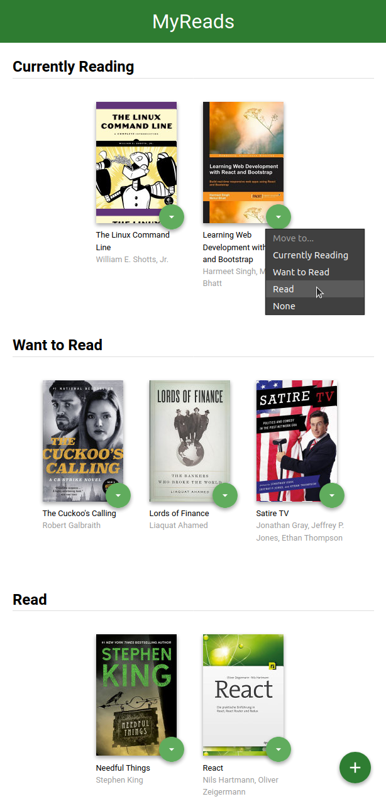
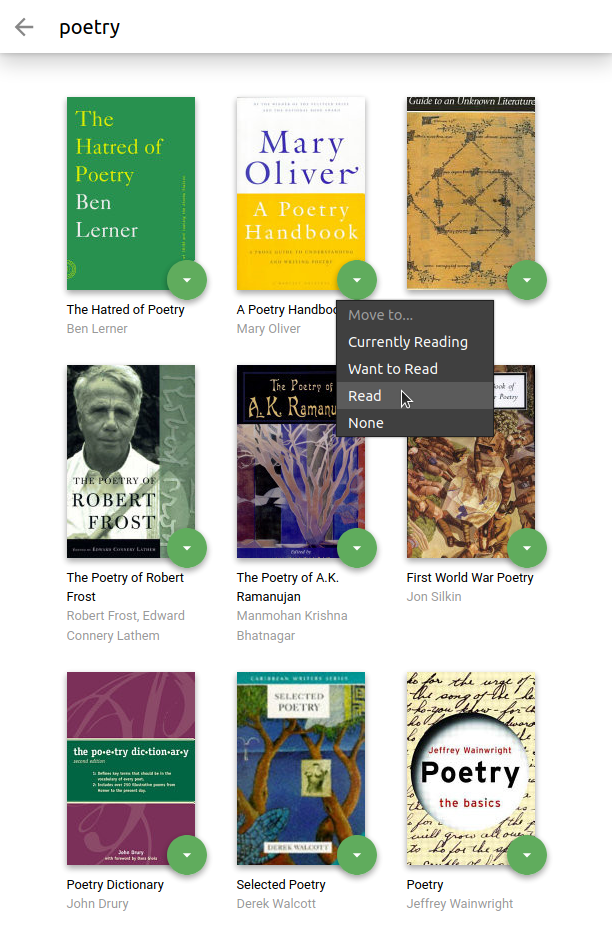

# The BookShelf app

A React project of the [Udacity Front End Web Developer Nanodegree](https://www.udacity.com/course/front-end-web-developer-nanodegree--nd0011).

The bookshelf app allows you to select and categorize books you have read, are currently reading, or want to read.

The main page displays a list of "shelves". Each book has a control that lets you select the shelf for that book.

There is also a search page that allows you to find books to add to your library.

## Setup

To develop the project:

* install all project dependencies with `npm install`
* start the development server with `npm start`

This will open a browser tab in which you can use the app.

Happy reading!

## Starter code

https://github.com/udacity/reactnd-project-myreads-starter/

## Screenshots

***Home page:***

***Search page:***

